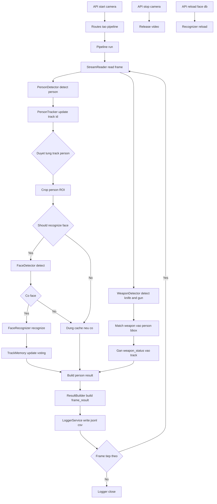
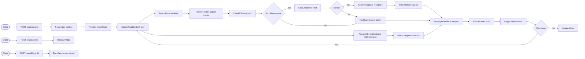
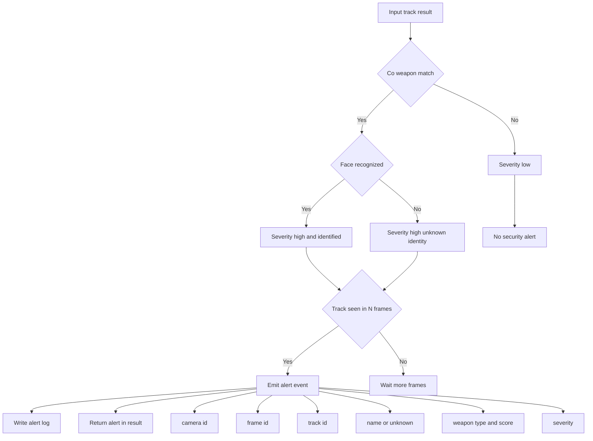

# Tai lieu xay dung he thong Backend AI va API (Body Camera)

## 1. Muc tieu he thong

He thong Backend AI duoc xay dung cho bai toan giam sat tu body camera, ket hop dong thoi 3 nang luc:

- Nhan dien nguoi theo thoi gian thuc
- Nhan dien vu khi voi 2 lop muc tieu: Knife va Gun
- Nhan dien khuon mat va so khop voi kho du lieu de dinh danh

Muc tieu ky thuat:

- Do tre thap, phan hoi gan realtime
- On dinh ket qua theo track_id
- Co co che canh bao su kien nguy co cao
- De mo rong cho nhieu camera va nhieu rule canh bao

## 2. Kien truc tong the

He thong gom 3 lop:

- Lop API: FastAPI route dieu khien camera pipeline va reload face DB
- Lop Pipeline: orchestrator xu ly frame theo thu tu
- Lop Service AI: stream, detect person, track, detect face, detect weapon, recognize face, memory, logger

Module lien quan trong source:

- app/main.py: FastAPI entrypoint
- app/api/routes.py: start/stop camera, reload face DB
- app/core/pipeline.py: luong person + face recognition (hien tai)
- app/services/weapon_detector.py: detect person + weapon (Knife/Gun)
- app/services/face_detector.py, face_recognizer.py, track_memory.py: nhan dien va on dinh dinh danh

Ghi chu trang thai hien tai:

- Nhanh person + face recognition da duoc noi vao pipeline chinh.
- Nhanh weapon detection da co module rieng, can noi vao pipeline chinh de xuat ket qua hop nhat trong cung frame_result.

## 3. So do luong xu ly tong quan (target)

## 4. So do sequence runtime (target)

## 5. So do logic rule canh bao (target)

## 6. Thiet ke API

Base path: /api/v1

### 6.1 He thong

- GET /health: kiem tra service song
- GET /cameras: danh sach camera trong config

### 6.2 Dieu khien pipeline

- POST /cameras/{camera_id}/start: khoi dong pipeline
- POST /cameras/{camera_id}/stop: dung pipeline

Loi thuong gap:

- 404: camera_id khong ton tai
- 409: camera da dang chay

### 6.3 Face DB

- POST /face-db/reload: hot reload embeddings va names

### 6.4 API de xuat mo rong cho security

- GET /cameras/{camera_id}/status: trang thai camera pipeline
- GET /alerts/recent: lay alert gan nhat
- GET /alerts/summary: thong ke canh bao theo khoang thoi gian

## 7. Data model output theo frame (target)

Frame result de xuat:

- frame_id
- timestamp
- camera_id
- num_detections
- detections list:
  - track_id
  - person_bbox
  - face_bbox
  - name
  - score
  - status
  - source
  - weapon_detected (bool)
  - weapon_type (Knife | Gun | null)
  - weapon_score
  - risk_level
- alerts list:
  - type
  - severity
  - track_id
  - message

## 8. Rule nhan dien va canh bao

Rule 1: Person only

- Co person nhung khong co weapon
- Co the co identity hoac unknown
- Khong phat canh bao an ninh

Rule 2: Person with weapon

- Co weapon (Knife hoac Gun) gan voi person bbox
- Sinh security alert severity high
- Neu identity da co -> them ten trong alert

Rule 3: Unknown face with weapon

- Co weapon (Knife hoac Gun) nhung status identity unknown
- Day muc uu tien xu ly cao hon

Rule 4: Noise suppression

- Chi emit alert khi track duoc xac nhan qua N frame lien tiep
- Dung memory de giam false positive

## 9. Cau hinh quan trong

Trong app/config.py va detector modules:

- YOLO_MODEL_PATH: model person/weapon detection
- PERSON_CONF_THRESHOLD: nguong detect
- TRACKER_TYPE: bytetrack hoac botsort
- RECOGNITION_SIM_THRESHOLD: nguong cosine cho identity
- RECOGNITION_REFRESH_FRAMES: tan suat refresh track recognized
- UNKNOWN_RETRY_FRAMES: tan suat retry track unknown
- CAMERA_SOURCES: map camera id sang rtsp/webcam

Khuyen nghi bo sung:

- WEAPON_CONF_THRESHOLD
- ALERT_CONFIRM_FRAMES
- ALERT_COOLDOWN_FRAMES

## 10. Trien khai va van hanh

1. Cai package: pip install -r requirements.txt
2. Build face embeddings DB
3. Chay API: python -m app.main
4. Start camera qua endpoint
5. Theo doi output logs va alerts

Van hanh:

- Log frame_result vao jsonl/csv
- Log security alert vao file rieng
- Theo doi metrics: fps, alert rate, unknown rate, weapon rate

## 11. Lo trinh hoan thien

1. Noi weapon detector (Knife/Gun) vao pipeline chinh va tra ve trong frame_result.
2. Bo sung ResultBuilder schema cho weapon fields va alerts.
3. Bo sung tests cho rule person-with-weapon va unknown-with-weapon.
4. Them endpoint truy van alert de tich hop dashboard.

---

Tai lieu nay phuc vu thiet ke ky thuat cho backend AI body camera voi 3 nhanh chinh: person, face identification, weapon detection.
